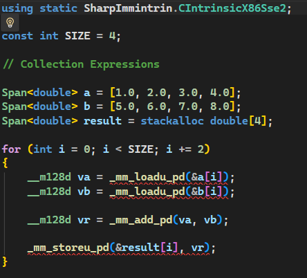
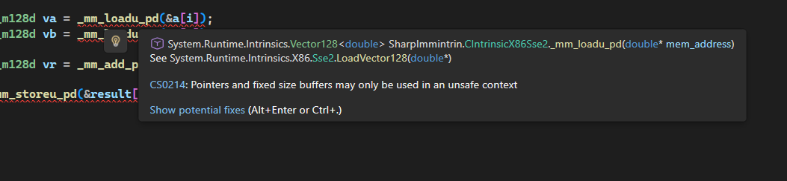

# SharpImmintrin
A simple .NET library which acts as a porting assistant that makes it much easier to port SIMD C code into C#.

### Sounds cool, but how?
Suppose that we have this C code and we want to port it into C#:

```c
#define SIZE 4
#include <emmintrin.h>  // SSE2 intrinsics

double a[SIZE] = {1.0, 2.0, 3.0, 4.0};
double b[SIZE] = {5.0, 6.0, 7.0, 8.0};
double result[SIZE];

for (int i = 0; i < SIZE; i += 2) {
    __m128d va = _mm_loadu_pd(&a[i]);
    __m128d vb = _mm_loadu_pd(&b[i]);

    __m128d vr = _mm_add_pd(va, vb);

    _mm_storeu_pd(&result[i], vr);
}
```

Right off the bat, we would port arrays and the outer for loop:
```cs
const int SIZE = 4;

// Collection Expressions

Span<double> a = [1.0, 2.0, 3.0, 4.0];
Span<double> b = [5.0, 6.0, 7.0, 8.0];
Span<double> result = stackalloc double[4];

for (int i = 0; i < SIZE; i += 2)
{
}
```

There's now a problem: methods like `_mm_loadu_pd` come from C SSE2 intrinsics,
and to someone who doesn't know how to use them, it can be difficult to port into C#.

Let's go ahead and install SharpImmintrin, as well as SharpImmintrin.GlobalUsings, from NuGet.

Now let's add these usings:

```cs
using static SharpImmintrin.CIntrinsicX86Sse2;
```

And let's paste that code:
```cs
__m128d va = _mm_loadu_pd(&a[i]);
__m128d vb = _mm_loadu_pd(&b[i]);

__m128d vr = _mm_add_pd(va, vb);

_mm_storeu_pd(&result[i], vr);
```

Suddenly, methods like `_mm_loadu_pd` are now defined.



Now, when we hover over them, we can see the exact equivalent in the .NET BCL
that this method maps into, in the XML documentation.



So, we can just replace that method with `Sse2.LoadVector128` accordingly.

Following the XML documentation, we now get this:

```cs
using System.Runtime.Intrinsics.X86;

const int SIZE = 4;

// Collection Expressions

Span<double> a = [1.0, 2.0, 3.0, 4.0];
Span<double> b = [5.0, 6.0, 7.0, 8.0];
Span<double> result = stackalloc double[4];

for (int i = 0; i < SIZE; i += 2)
{
    __m128d va = Sse2.LoadVector128(&a[i]);
    __m128d vb = Sse2.LoadVector128(&b[i]);

    __m128d vr = Sse2.Add(va, vb);

    Sse2.Store(&result[i], vr);
}
```

From then on, we can fix the code slightly, wrapping it in an unsafe block and making sure
we can access pointers to arrays.

```cs
using System.Runtime.Intrinsics;
using System.Runtime.Intrinsics.X86;

const int SIZE = 4;

// Collection Expressions

Span<double> a = [1.0, 2.0, 3.0, 4.0];
Span<double> b = [5.0, 6.0, 7.0, 8.0];
Span<double> result = stackalloc double[4];

unsafe
{
    fixed (double* aP = a)
    fixed (double* bP = b)
    fixed (double* resultP = result)
    {
        for (int i = 0; i < SIZE; i += 2)
        {
            Vector128<double> va = Sse2.LoadVector128(&aP[i]);
            Vector128<double> vb = Sse2.LoadVector128(&bP[i]);

            Vector128<double> vr = Sse2.Add(va, vb);

            Sse2.Store(&resultP[i], vr);
        }
    }
}
```

Which in turn gives us a C# representation of the C code.

And now when we're done with porting C code into C#, we can go ahead and uninstall the SharpImmintrin package. Simple as that.

> [!NOTE]
> Methods within SharpImmintrin are stubs. If you were to invoke them, you'd get an InvalidOperationException.
> They only exist to guide you into porting C code into C#.

### Supported architectures
- X86
  - AES
  - AVX
  - AVX2
  - AVX512BMM
  - AVX512BW
  - AVX512CD
  - AVX512F
  - AVX512VBMI
  - AVX512VBMI2
  - AVXVNNI
  - BMI1
  - BMI2
  - FMA
  - GFNI
  - LZCNT
  - PCLMULQDQ
  - POPCNT
  - SSE
  - SSE2
  - SSE3
  - SSE4.1
  - SSE4.2
  - SSSE3
- ARM
  - NEON (a.k.a. AdvSimd)

# License
Licensed under MIT, see [LICENSE.txt](LICENSE.txt)

# Building
```
git clone https://github.com/winscripter/SharpImmintrin.git
cd SharpImmintrin
dotnet build
```

To start tests: `dotnet test`
